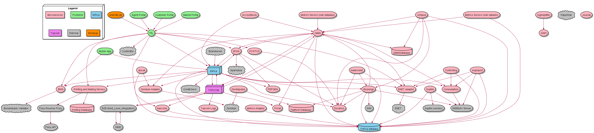

# About 

New Platform Service Inventory graph based on plantUML
Source for the graph on https://enerdigi.enercity.de/wiki/display/DIGITAL/Platform+Service+Inventory

### latest graph



### requirements 
  - Java
  - latest version of PlantUML (plantuml.jar, https://plantuml.com/download)

### generate diagram using command line
 plantuml.jar must either be in your path or you need to specify the exact path
 code must bei in current path
 1) Save code as .puml / .txt (here code.puml)
 2) open cmd 
 3) generate .svg diagram with: 
 ```bash
 java -jar plantuml.jar code.puml -tsvg
 ```
 4) generate .png diagram with: 
  ```bash
 java -jar plantuml.jar code.puml -tpng
 ```
 5) find generated diagrams in path 
 
  More ways to run PlantUML: 
  https://plantuml.com/de/running

### more information
 Find more information here:
 http://plantuml.com/de/guide
 https://plantuml.com/de/command-line
 https://plantuml-documentation.readthedocs.io/en/latest/command_line_reference.html
 